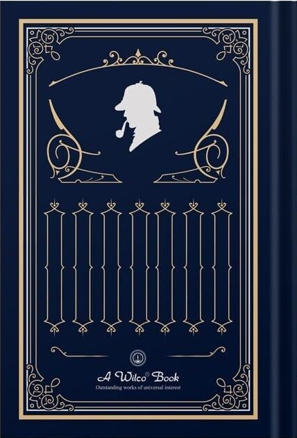

# CS 8395-08 Augmented Reality
## Siqi Lu  Project 3 AR Bookcover

Project Link:  https://drive.google.com/drive/folders/1sa8OtmdbKjc6RcDMEk80DjMl28sAOFHQ 

Demo Link: https://drive.google.com/file/d/1tuSOfbdbSnwBJSedrpRmMQt09t8ZlfhW

### To run the code, user need to download the whole ./project3/bookcover folder and open it in Unity, or open the unity project ./project3/bookcover/Assets/bookcover.unity 

    

Front and back images (above) of the book and two of the scripts are added to the repo:

  1) btn.cs
        
        This script is used to define the feature of the button. When user put hand on the button arear, a book review will shows up.

  2) Spinning.cs

        This script defines the behavior of the virtual objects, which will made the target object spin.

### Limitation

  Overall my project is efficient and fun to run. However, some of the feature are quite simple such as the spinning script. 
